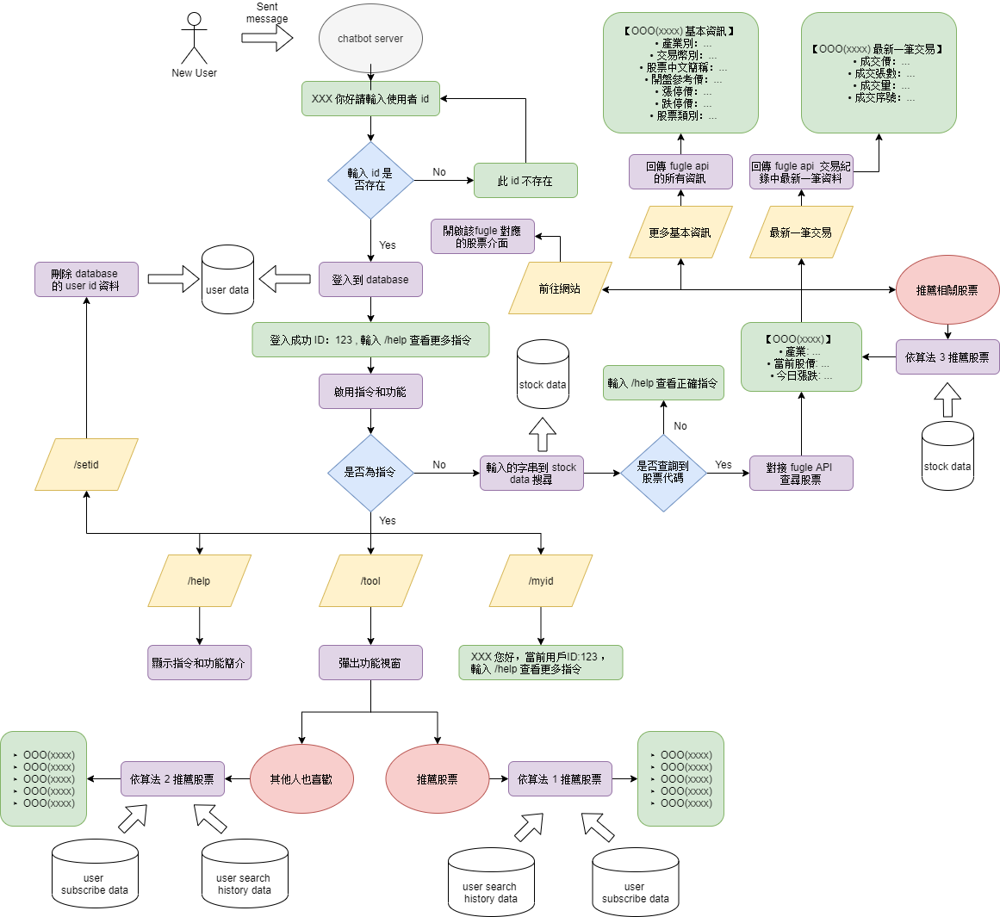

# 已股票特徵和用戶數未足跡對用戶進行股票推薦(python 版)
此 folder 是 telegram chatbot 最終版，data 方面暫不提供。

## 執行進度
- [x] 將演算法由 R 轉 python
- [X] 檢查程式中的演算法轉換是否有錯
- [X] 建立聊天機器人
- [X] 建立整個 dataflow

## 架構圖


## 方法介紹
這邊我們以各股票的四個長期指標 (*CAPM_Beta*、*本益比*、*殖利率*、*股價淨值比*) 作為該股票的一個數值上的特徵向量。另外我們還使用用戶的數位足跡(訂閱紀錄&瀏覽紀錄)，將所有看過的股票轉換為該用戶的一個特徵向量，也就是說我們可以依造用戶看了哪些股票，並依造那些股票的特徵計算屬於該客戶的特徵向量，並利用此向量與所有股票計算距離，取其最近的幾檔股票最推播。

## 數值介紹
- CAPM_Beta: 
- 本益比
- 殖利率
- 股價淨值比

## 計算距離的方法
- 歐幾里得距離(*euclidean distance*) - default
- 餘弦相似度(*cosine similarity*)
- 皮爾森相關性係數(*person correlation coefficient*)

## 問題
1. 不一定所有用戶看過的股票他都喜歡
2. 搞不好用戶喜歡的股票，基本數值差異大，導致該用戶的特徵向量被平均，進而推薦原本用戶不感興趣的股票
3. 因為是以長期指標為準，對喜愛短期的用戶不適合
4. 當用戶缺乏專業，他的所關注的股票可能體質都不太好，這時如果我們的以算法推薦同樣體質不好的股票就不好了

# 使用 flask & ngrok 與 telegram chatbot 建立 web hook 
## 相關網站
- [參考網站](https://medium.com/@zaoldyeck/%E6%89%8B%E6%8A%8A%E6%89%8B%E6%95%99%E4%BD%A0%E6%80%8E%E9%BA%BC%E6%89%93%E9%80%A0-telegram-bot-a7b539c3402a)
- [telegram api](https://core.telegram.org/bots/api)
## 需求
- pip install telegram
- pip install --upgrade python-telegram-bot
- 
## Step 1 : 申請 telegram chatbot 
這個 part 主要以建立新的 chatbot 為主，設定的化其實蠻人性化的，就自己研究吧。 
1. 加入 BotFather 好友後，它會親切地問候，並告訴你他能為你提供什麼服務。
    - 在 chatbort 方面，主要有下列兩個指令 建立新的機器人、編輯已有的機器人，只要進去後 BotFather 就會自動指引。
    ```
    /newbot - create a new bot
    /mybots - edit your bots [beta]
    ```
2.  輸入 `/newbot` -> 建立新的chatbot


## Step 2: 建立 ngrok (這個部分程式已經自動化)
1. 申請 bot ，\newbot -> bot 的名稱
2. 下載 ngrok，丟到 fugle_telegram_chatbot 資料夾
3. ngrok 認證帳號 (要先申請帳號)，直接輸入: 
    ```
    ngrok authtoken [your token]
    ```
4. cd 到 fugle_telegram_chatbot ，輸入:
    ```
    ngrok http 5000
    ```
5. 在同個目錄底下建立 `config.ini` 
6. 執行程式建立 server 
7. 加入機器人好友 [fintech](http://t.me/myfugle_bot)

